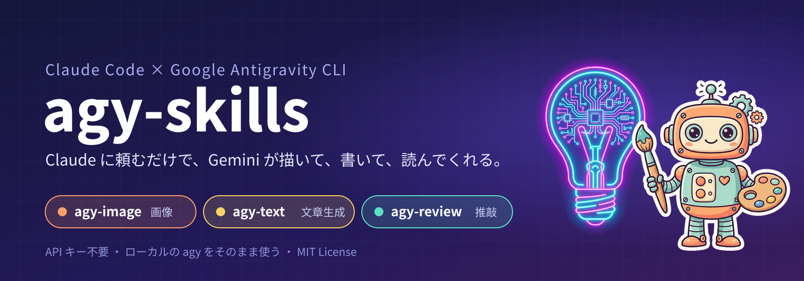
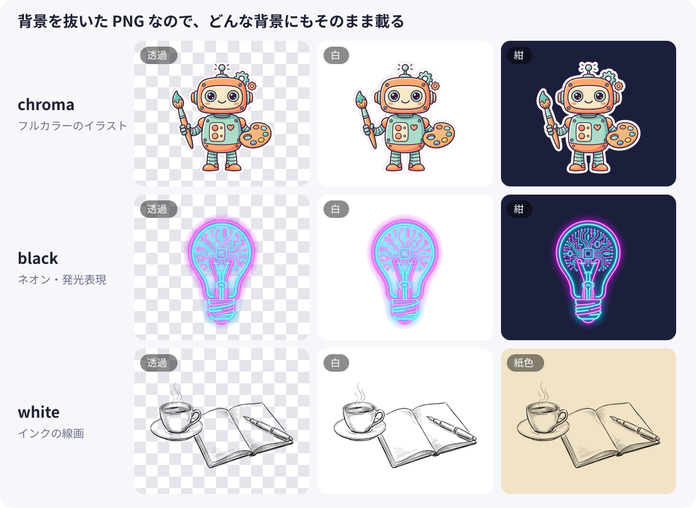
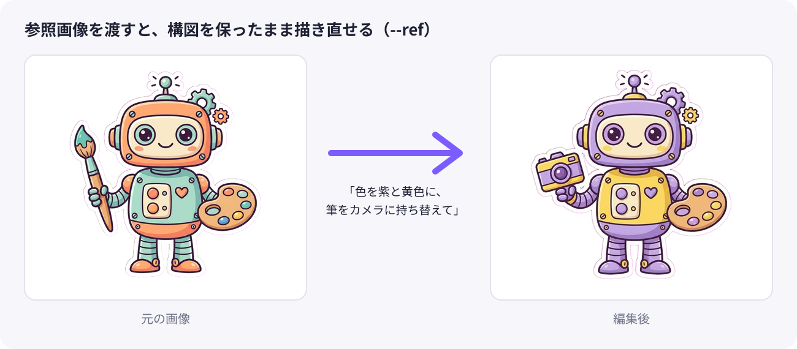
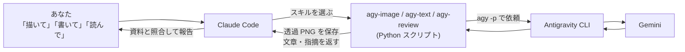

<div align="center">



[](https://code.claude.com/docs/en/plugins)
[](https://antigravity.google/docs/cli/)
[](.claude-plugin/marketplace.json)
[](LICENSE)

**Claude Code に日本語で頼むだけで、Google Antigravity(`agy`)の Gemini が<br>画像を描き、文章を書き、原稿を読んでくれるプラグインです。**

[3 ステップで始める](#-3-ステップで始める) ・ [agy-image](#-agy-image画像を描く) ・ [agy-text](#%EF%B8%8F-agy-text文章を書く) ・ [agy-review](#-agy-review原稿を読んでもらう) ・ [しくみ](#-しくみ) ・ [English](#english)

</div>

---

## ✨ できること

<table>
<tr>
<td width="33%" valign="top">

### 🎨 agy-image
**「◯◯のイラストを作って」**

- 背景を抜いた **透過 PNG が既定**
- 既存の画像を渡して **構図を保ったまま描き直し**
- アスペクト比と保存先を指定できる

</td>
<td width="33%" valign="top">

### ✍️ agy-text
**「Gemini に下書きさせて」**

- メール、要約、翻訳、紹介文を **資料から書く**
- タイトル案などを **複数案まとめて**
- 形を指定した **JSON** でも受け取れる

</td>
<td width="33%" valign="top">

### 📝 agy-review
**「この原稿を Gemini にも読ませて」**

- **推敲・批評・書き直し・自由指示** の 4 モード
- ファイルは書き換えず、指摘をテキストで返す
- Claude が精査し、採用分だけ反映

</td>
</tr>
</table>

> [!TIP]
> どれも **API キー不要**。ローカルにログイン済みの Antigravity CLI とそのクォータで動きます。

---

## 🚀 3 ステップで始める

**1. Antigravity CLI を入れてログインする**

[Antigravity CLI](https://antigravity.google/docs/cli/) をインストールしてログインし、次のコマンドでモデル一覧が出れば準備完了です。

```bash
agy models
```

**2. Claude Code にプラグインを追加する**

```
/plugin marketplace add wildriver/agy-skills
/plugin install agy-skills@agy-skills
```

<details>
<summary>シェルから入れる場合・手動で入れる場合</summary>

```bash
claude plugin marketplace add wildriver/agy-skills
claude plugin install agy-skills@agy-skills
```

手動なら、クローンしてスキルのフォルダを `~/.claude/skills/` にリンクします。

```bash
git clone https://github.com/wildriver/agy-skills.git
for s in agy-image agy-text agy-review; do
  ln -s "$PWD/agy-skills/plugins/agy-skills/skills/$s" ~/.claude/skills/
done
```

更新は `claude plugin marketplace update agy-skills` です。

</details>

**3. 普段どおり頼む**

```
> 研究紹介スライドの表紙に置く、スマホを操作する手のイラストを 16:9 で作って
> abstract.md を元に、共同研究の相談メールを Gemini に下書きさせて
> draft.md を Gemini に推敲させて。である調の技術記事です
```

Claude が内容に合うスキルを選んで実行します。明示的に呼ぶなら `/agy-image`、`/agy-text`、`/agy-review` です。

---

## 🎨 agy-image：画像を描く

### 透過 PNG がそのまま使える

agy の画像生成は常に背景付きの JPEG を返します。agy-image は単色の背景で描かせてから手元で背景を抜き、**被写体だけの透過 PNG** にして保存します。抜き方はプロンプトから自動で選びます。

<p align="center"></p>

| 抜き方 | 選ばれる条件 | 向いている絵 |
|---|---|---|
| `chroma` | 下の 2 つ以外 | フルカラーのイラスト、人物、物 |
| `black` | neon、glow など発光の語を含む | ネオン、光のエフェクト |
| `white` | ink、sketch など線画の語を含む | ペン画、モノクロのスケッチ |

背景込みの一枚絵が欲しいときは `--transparent none` を付けます。

### 参照画像で描き直す

<p align="center"></p>

参照画像は最大 3 枚まで渡せます。色替え、持ち物の差し替え、要素の追加など、変えたい点だけを伝えれば構図は保たれます。

<details>
<summary>コマンドとオプション</summary>

```bash
python3 plugins/agy-skills/skills/agy-image/scripts/agy_image.py "<英語のプロンプト>" \
  --out images/hero.png --aspect 16:9 [--ref base.png] [--transparent auto|black|white|chroma|none] [--no-trim]
```

| オプション | 意味 |
|---|---|
| `--aspect` | `1:1`(既定) `2:3` `3:2` `3:4` `4:3` `9:16` `16:9` |
| `--ref` | 参照・編集元の画像。最大 3 枚 |
| `--transparent` | 背景の抜き方。既定は `auto` |
| `--no-trim` | 被写体での切り抜きをせず、全体の大きさを保つ |
| `--name` | agy に渡す画像名(省略時は `--out` から作る) |
| `--timeout` | 待ち時間(分)。既定 6 |

成功すると `out`、`width`、`height`、`seconds` などを 1 行の JSON で出力します。抜く前の原本も `<名前>_flat.jpg` として残るので、再編集の `--ref` に使えます。

</details>

---

## ✍️ agy-text：文章を書く

### 実際の出力

次の短い研究メモを `--input` で渡し、2 通りの依頼をしました。

> Webアンケートの回答画面をスライドバー型UIにすると、つまみを動かす軌跡から「迷い」の手がかりが得られる。(中略)調査会社との共同研究では、購入意向に迷いの申告と操作ログを加えると、実際の購入との一致度が高まった。ただし標本は小さい。

**「一般向け記事のタイトル案」を `--variants 3` で**

1. スライドバーを動かす手元に潜む「本音」――操作ログの軌跡から回答者の“迷い”を読み解く
2. 「買います」の裏にある躊躇を見抜く：操作の迷いを可視化してアンケートと実購買のズレを埋める新手法
3. ラジオボタンでは見えなかった心の揺らぎ――UIをスライドバーに変えるだけで「迷い」のデータが手に入る理由

**「発表スライド 1 枚分の要点」を `--schema` で形を指定して**

```json
{
  "title": "スライドバー型UI操作ログによる「迷い」の検知と購入予測",
  "points": [
    "スライドバーの軌跡から平均速度・最低速度・ばらつき・選び直し回数など多様な「迷い」の指標を抽出可能",
    "回答時間しか差が出ないラジオボタンに対し、スライドバーでは複数の操作挙動に有意な差が確認された",
    "購入意向に迷いの申告と操作ログを加えることで、実際の購入行動との一致度が高まる"
  ],
  "caveat": "実験および調査の標本サイズが小さい点"
}
```

> [!WARNING]
> **事実を含む文章は、必ず資料を `--input` で渡してください。** 資料なしで「この研究の紹介文を」と頼んだところ、実際の研究にない「マウス軌跡」「機械学習」を含む紹介文が返ってきました。スキルには、生成物を資料と突き合わせて確認し、Gemini の文章だと明示するよう書いてあります。

<details>
<summary>コマンドとオプション</summary>

```bash
python3 plugins/agy-skills/skills/agy-text/scripts/agy_text.py "資料を、共同研究の相談メールの本文(200字程度)にまとめて" \
  --input abstract.md --context "宛先は他分野の教授。丁寧な敬語"
python3 plugins/agy-skills/skills/agy-text/scripts/agy_text.py "記事タイトル案" --input abstract.md --variants 5
python3 plugins/agy-skills/skills/agy-text/scripts/agy_text.py "要点を抽出" --input abstract.md --schema slide.json --out slide.json
```

| オプション | 意味 |
|---|---|
| `--input` | 下敷きにする資料ファイル。複数可 |
| `--context` | 読者・媒体・目的・文体・分量 |
| `--variants N` | 切り口の違う案を N 通り |
| `--json` / `--schema` | JSON で受け取る。形が合わなければ 1 回だけ自動で再依頼 |
| `--request-file` / `-` | 長い依頼文をファイルや標準入力から読む |
| `--model` | 既定 `gemini-3.8-flash-high` |
| `--out` | 結果をファイルにも保存 |

</details>

---

## 📝 agy-review：原稿を読んでもらう

### 実際の出力

次の一文を、既定のモデル(Gemini 3.8 Flash)に推敲させた結果です。

<table>
<tr><th width="50%">元の文章</th><th width="50%">推敲後</th></tr>
<tr>
<td valign="top">スマートフォンのタッチパネルは、静電容量方式が主流であり、指が触れる<b>事</b>で電界が変化し、それを検出する<b>事</b>で位置を特定する。近年では、タッチの強さや接触面積<b>等</b>の情報も取得可能に<b>なってきており</b>、<b>様々</b>な応用が検討されている。</td>
<td valign="top">スマートフォンのタッチパネル<b>では</b>、静電容量方式が主流であり、<b>指が触れた際の電界変化を検出して</b>位置を特定する。近年では、タッチの強さや接触面積<b>など</b>の情報も取得可能<b>となり</b>、<b>さまざま</b>な応用が検討されている。</td>
</tr>
</table>

指摘は理由付きで返ります(抜粋)。

```markdown
## 指摘
- 「スマートフォンのタッチパネルは、」→「スマートフォンのタッチパネルでは、」:
  述部「位置を特定する」との主述のねじれを解消し、文構造を明確にするため。
- 「接触面積等の情報」→「接触面積などの情報」:
  技術文書の一般的な用字用語基準に合わせ、形式的な漢字(等)を平仮名に統一するため。
```

### 4 つのモード

| モード | 返ってくるもの | 使う場面 |
|---|---|---|
| `proofread`(既定) | 指摘一覧と修正後の全文 | 表記・文法・冗長さを直したい |
| `critique` | 重大な問題、改善推奨、良い点 | 論理の飛躍や構成を見てほしい |
| `rewrite` | 修正後の全文だけ | 自分で差分を取って選びたい |
| `custom` | 指示どおりの内容 | 査読者役、表記ゆれ一覧、翻訳チェックなど |

<details>
<summary>コマンドとオプション</summary>

```bash
python3 plugins/agy-skills/skills/agy-review/scripts/agy_review.py draft.md
python3 plugins/agy-skills/skills/agy-review/scripts/agy_review.py intro.md --mode critique --context "研究会原稿、である調"
python3 plugins/agy-skills/skills/agy-review/scripts/agy_review.py abstract.md --mode custom --instructions "Act as a CHI reviewer..."
python3 plugins/agy-skills/skills/agy-review/scripts/agy_review.py draft.md --model gemini-3.1-pro-high --out review.md
```

| オプション | 意味 |
|---|---|
| `--mode` | `proofread` `critique` `rewrite` `custom` |
| `--context` | 読者・媒体・目的。付けると指摘の精度が上がる |
| `--instructions` | 追加の指示。`custom` では必須 |
| `--model` | 既定 `gemini-3.8-flash-high`。一覧は `agy models` |
| `--out` | 結果をファイルにも保存 |

</details>

---

## 🔧 しくみ



- agy はヘッドレスモードではファイルを読めません。そのため原稿や資料はプロンプトに埋め込み、参照画像は `generate_image` の機能で渡します。`--dangerously-skip-permissions` は使いません。
- 背景の透過処理は Python の標準ライブラリだけで動きます。Pillow があればそれを使います。

---

## 📋 動作環境と注意

| 項目 | 内容 |
|---|---|
| 必須 | Antigravity CLI(ログイン済み)、Python 3.8 以上 |
| 検証環境 | macOS 15、agy 1.2.3、Claude Code 2.1 |
| 未検証 | Linux、Windows |
| 所要時間 | 画像 1 枚 30〜70 秒、文章の生成・推敲は 20〜50 秒 |

> [!IMPORTANT]
> **シェルが使える Claude Code(ターミナルまたは Desktop の Code タブ)でのみ動きます。** Claude Desktop の PowerPoint・Word 連携や Cowork のようなサンドボックスには `agy` が無いため実行できません。その場合は Claude Code で画像や文章を作り、ファイルを渡してください。

<details>
<summary>知っておくと役立つ挙動</summary>

- 画像モデルは Antigravity 側で固定されていて選べません。出力は約 1K 解像度(16:9 で 1376×768 程度)です。
- 生成画像の原本は `~/.gemini/antigravity-cli/brain/<会話ID>/` に残ります。場所が違う環境では `AGY_BRAIN_DIR` で指定できます。
- `agy` が PATH に無いときは `~/.local/bin/agy` などを探します。見つからなければ `AGY_BIN=/path/to/agy` を設定してください。
- プロンプトに「no text」と書いても英字のラベルが入ることがあります。強めに否定するか、`--ref` で「remove all text」と描き直してください。
- 目盛りの数など、正確な個数が必要な図は苦手です。そうした図は SVG などで描く方が確実です。
- 被写体に背景と同じ色(`black` での黒い塗り、`chroma` でのマゼンタ)があると、その部分も透けます。
- agy 自身の `--json-schema` フラグは、print モードでは本文ではなく作業要約を返すため使っていません。agy-text の JSON 出力はプロンプトで指示し、手元で検証しています。

</details>

<details>
<summary>リポジトリ構成</summary>

```
.claude-plugin/marketplace.json      # マーケットプレイス定義
plugins/agy-skills/
  .claude-plugin/plugin.json         # プラグイン定義
  skills/agy-image/                  # SKILL.md, scripts/agy_image.py, scripts/alpha.py
  skills/agy-text/                   # SKILL.md, scripts/agy_text.py
  skills/agy-review/                 # SKILL.md, scripts/agy_review.py
docs/images/                         # README の画像(イラストは agy-image で生成)
```

</details>

---

## English

<details>
<summary>Read in English</summary>

**agy-skills** is a Claude Code plugin that lets Claude drive Google's Antigravity CLI (`agy`), so Gemini can draw images, write text, and review your drafts. No API key is needed; it uses your local, signed-in `agy`.

- **agy-image** generates or edits images with agy's built-in `generate_image` tool. By default it returns a **transparent PNG** trimmed to the subject: it asks for a flat background and keys it out locally (`chroma`, `black`, or `white`, picked automatically from the prompt). Pass up to three reference images with `--ref` to redraw while keeping the composition.
- **agy-text** writes new text with Gemini (default `gemini-3.8-flash-high`): emails, summaries, translations, intros, several title ideas at once (`--variants`), or JSON validated against a schema (`--schema`). Always pass source material with `--input` for factual content; without it Gemini will make up plausible details.
- **agy-review** sends a draft to Gemini for proofreading, critique, a full rewrite, or custom instructions, and returns text only. It never edits your files.

Install inside Claude Code:

```
/plugin marketplace add wildriver/agy-skills
/plugin install agy-skills@agy-skills
```

Then just ask, e.g. "Make a 16:9 illustration of a hand using a smartphone for my title slide", "Have Gemini draft an email from abstract.md", or "Have Gemini proofread draft.md". Requires a signed-in Antigravity CLI and Python 3.8+. Tested on macOS 15 with agy 1.2.3. It does not run inside sandboxed environments without a shell, such as the Claude for PowerPoint add-in.

</details>

---

<div align="center">

MIT License ・ README のイラストはすべて agy-image で生成しています

</div>
